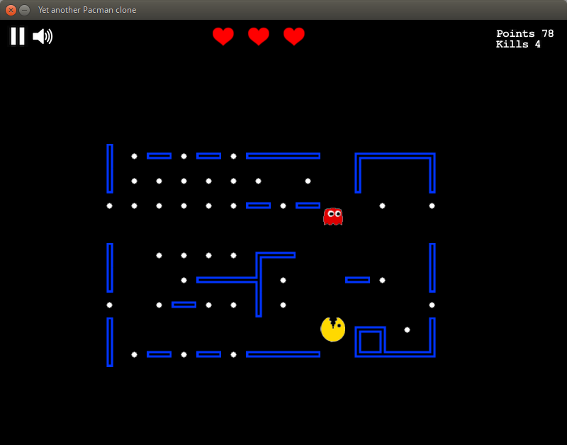
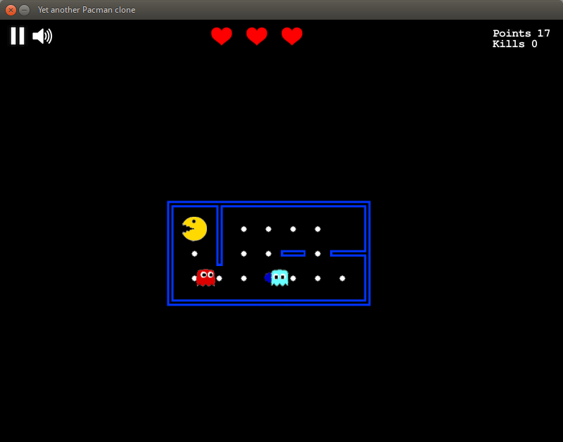

  
  

# Pacman

Simple implementation of the classical Pacman game written in java. 

Supports
- Sprite-based graphics
- Sound
- Level progression
- Highscore
- Various buffs

# Usage
Just import to any Java IDE (e.g. IntelliJ) and run.

# Acknowledgements
Over 80% of the code was written by me, some of the UI and sound code was written by [Nicolas Acero](https://github.com/Nsteel).
